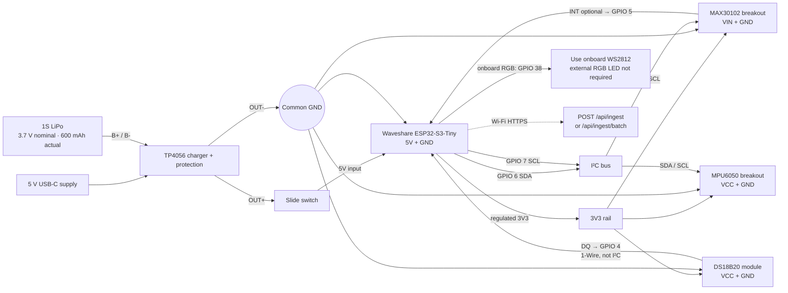

# SepCare Hardware Single Source of Truth — Prototype v1

**Status:** build-authoritative for the benchtop prototype, updated 2026-09-19.

This replaces the old nRF52840 + Raspberry Pi / BLE architecture in `context/implementation-plans/neonatal-sepsis-armband.md`. The actual device is a **Waveshare ESP32-S3-Tiny** which uploads summaries directly to the backend over Wi-Fi. The full-size ESP32-WROOM mentioned elsewhere is not part of this build.

> Safety boundary: this is an engineering prototype, not a clinical device. Do not attach a battery-powered, unvalidated device to a newborn or use it for clinical decisions. Build, inspect, and charge it only under adult supervision on a non-flammable surface.

## The one schematic to follow



**Never connect the raw LiPo, TP4056 B+/B-, or TP4056 OUT+ directly to a 3V3 pin.** The approved power path for this prototype is TP4056 `OUT+` → slide switch → S3-Tiny `5V`, with the S3-Tiny's onboard regulator supplying the 3.3V sensor rail.

## Required parts and gaps

| Item             | Build decision                                                         | Status                                                                                                                       |
| ---------------- | ---------------------------------------------------------------------- | ---------------------------------------------------------------------------------------------------------------------------- |
| MCU              | Waveshare ESP32-S3-Tiny (ESP32-S3FH4R2)                                | Use this board only                                                                                                          |
| Battery          | 1S 3.7 V**600 mAh** LiPo                                         | Actual part, supersedes 1100 mAh note                                                                                        |
| Charger          | TP4056 with protection                                                 | Actual part; check labels before wiring                                                                                      |
| Charging current | 300 mA preferred (0.5 C); 500 mA only if the cell datasheet permits it | **Verify/change TP4056 RPROG**; nominally ~4.0 kΩ targets ~300 mA, but confirm against the actual module/IC datasheet |
| PPG              | MAX30102 breakout                                                      | Actual part; powered from 3V3 only                                                                                           |
| Motion           | MPU6050 breakout                                                       | Actual part; powered from 3V3 only                                                                                           |
| Temperature      | DS18B20 module                                                         | Actual part; 1-Wire, not I²C                                                                                                |
| Alert LED        | S3-Tiny onboard WS2812 on GPIO 38                                      | Use first; external common-cathode RGB is optional                                                                           |

The S3-Tiny's onboard regulator supplies the 3.3V rail for all sensors. The approved battery path is TP4056 `OUT+` → switch → S3-Tiny `5V`, and TP4056 `OUT-` → S3-Tiny GND. A TP4056 board is not a load-sharing/power-path controller, so turn the device **off** while charging.

## Exact solder/wire map

All modules run at **3.3 V**. Make one short, low-resistance ground bus and one 3V3 bus on the perfboard. Keep the PPG wires especially short and away from the Wi-Fi antenna and switching regulator.

| From                   | To                                     | Wire / net                | Notes                                                                        |
| ---------------------- | -------------------------------------- | ------------------------- | ---------------------------------------------------------------------------- |
| LiPo positive          | TP4056`B+`                           | battery positive          | Use the battery connector if fitted; do not reverse it                       |
| LiPo negative          | TP4056`B-`                           | battery ground            |                                                                              |
| TP4056`OUT+`         | slide-switch input                     | protected load positive   | Use`OUT`, not `B`, for the load                                          |
| slide-switch output    | S3-Tiny `5V`                            | switched main-board power | Do not connect this net to sensor VCC/VIN                                   |
| TP4056 `OUT-`         | S3-Tiny GND, every sensor GND           | common ground             | All grounds must be common                                                   |
| S3-Tiny `3V3`         | all sensor `VCC/VIN`                    | 3V3                       | The S3-Tiny's onboard regulator supplies this rail                          |
| S3-Tiny`GPIO 6`      | MAX30102`SDA`, MPU6050 `SDA`       | I²C SDA                  | 400 kHz maximum for MAX30102                                                 |
| S3-Tiny`GPIO 7`      | MAX30102`SCL`, MPU6050 `SCL`       | I²C SCL                  | One shared bus                                                               |
| S3-Tiny`GPIO 5`      | MAX30102`INT`                        | PPG interrupt             | Optional for first bring-up; use polling if left open                        |
| S3-Tiny`GPIO 4`      | DS18B20`DQ` / `DATA`               | 1-Wire data               | This is a separate bus                                                       |
| 4.7 kΩ resistor       | DS18B20 DQ ↔ 3V3                      | 1-Wire pull-up            | Omit only after confirming your specific module already contains the pull-up |
| S3-Tiny`GPIO 38`     | onboard WS2812                         | RGB data                  | Already wired on board; no soldering                                         |

GPIO 4/5/6/7 are deliberately selected from the S3-Tiny’s exposed low-numbered GPIOs, avoiding the boot pin (GPIO 0), USB data pins, and the board’s RGB GPIO 38. In firmware, initialise I²C explicitly with `SDA=6` and `SCL=7`; do not assume ESP32-WROOM default pins.

## Build order — do not skip stages

1. With the battery disconnected, assemble only S3-Tiny + sensors. Power from its USB adapter and confirm 3.3 V at every sensor VCC pin.
2. Scan I²C. Expected addresses: MAX30102 `0x57`; MPU6050 normally `0x68` (or `0x69` if its AD0 jumper is changed). Confirm DS18B20 separately with a 1-Wire scan.
3. Confirm the MAX30102 signal changes with finger contact, MPU6050 axes respond to movement, and DS18B20 gives a plausible temperature. Treat readings as engineering data only.
4. Assemble the TP4056 and switch stage with the **MCU disconnected**. Verify switch polarity, continuity from switched output to the S3-Tiny `5V` pin, and no short between 5V/GND or 3V3/GND.
5. Check the TP4056’s charge-program resistor and the LiPo’s permitted charge rate. For a 600 mAh cell, target 300 mA unless its manufacturer explicitly allows more. A nominal 1 A setting is not approved for this build.
6. Connect the S3-Tiny `5V` and GND to the protected, switched battery path. Test battery boot, one Wi-Fi transmission, then switch-off current. Re-test the board from USB separately; do not charge and run the device together.
7. Only after bench validation, insulate every exposed joint with heat-shrink, keep the LiPo protected from puncture/bending, and keep the antenna unobstructed.

## Software-to-hardware contract

The backend branch expects a periodic summary, not raw waveforms:

```json
{
  "deviceId": "nb-001",
  "timestamp": 1760000000000,
  "vitals": {
    "heartRate": 132,
    "spo2": 97,
    "temperature": 36.9,
    "activityScore": 4
  }
}
```

- Send a live reading to `POST /api/ingest` with `X-API-Key`.
- Buffer failed readings locally with their original Unix-epoch-millisecond timestamp, then upload no more than 500 readings to `POST /api/ingest/batch` after Wi-Fi returns.
- The current v1 backend scores temperature, HR-vs-temperature behaviour, and activity trend. It stores `spo2`, but it does **not** yet consume raw HRV, perfusion, or respiratory data in risk logic.
- Use deep sleep and periodic wake/sample/transmit cycles, but measure actual current on the completed board. The S3-Tiny’s board-level power consumption and the breakout modules prevent a runtime claim from capacity alone.

## Corrections to earlier documentation

1. The original plan’s nRF52840/Raspberry Pi/BLE architecture is obsolete; this prototype is ESP32-S3-Tiny → Wi-Fi → backend.
2. DS18B20 is **1-Wire**, not an I²C device. MAX30102 and MPU6050 share I²C.
3. The actual LiPo capacity is **600 mAh**, not the earlier 500 mAh target nor the old 1100 mAh purchased-item placeholder.
4. The TP4056 is a charger/protection stage. For this prototype it feeds the S3-Tiny `5V` input through the slide switch; only the S3-Tiny's regulated `3V3` output feeds sensors.

## References used to resolve hardware facts

- [Waveshare ESP32-S3-Tiny documentation](https://docs.waveshare.com/ESP32-S3-Tiny): exposed GPIO, onboard GPIO 38 WS2812, 3.3 V LDO, and FPC handling warnings.
- [MAX30102 datasheet](https://www.analog.com/media/en/technical-documentation/data-sheets/MAX30102.pdf): I²C up to 400 kHz and device-level supply requirements. This schematic applies to the **breakout** board powered at 3.3 V, not the bare IC.
- [MPU-6050 product specification](https://invensense.tdk.com/wp-www.invensense.com/wp-content/uploads/2015/02/MPU-6000-Datasheet1.pdf): device-level supply/interface requirements. This schematic applies to the 3.3 V-powered breakout board.
- [TP4056 electrical table](https://htmlapp.alldatasheet.com/html-pdf/1790669/UMW/TP4056/333/5/TP4056.html): charge current is set by RPROG; 2.4 kΩ is nominally 500 mA. Confirm the actual module’s resistor and your LiPo’s cell datasheet before any charge cycle.
